# Sistema De Recomendación De Restaurantes Con Neo4j

**Universidad San Carlos de Guatemala**
**Facultad de ingeniería**
**Ingeniería en ciencias y sistemas**
**Sistemas de bases de datos 2**

---

## 1. Diseño del Modelo de Grafos

Este proyecto implementa una base de datos basada en grafos utilizando **Neo4j** para gestionar y analizar datos relacionados con un entorno gastronómico, permitiendo realizar recomendaciones inteligentes basadas en preferencias y relaciones.

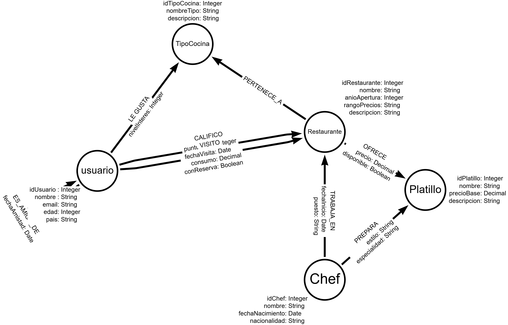

### 1.1 Entidades (Nodos)
El modelo consta de **5 nodos principales**:
- **`Usuario`**: Personas que utilizan la aplicación.
  - `idUsuario` (Integer)
  - `nombre` (String)
  - `email` (String)
  - `edad` (Integer)
  - `pais` (String)
- **`Restaurante`**: Establecimientos de comida.
  - `idRestaurante` (Integer)
  - `nombre` (String)
  - `anioApertura` (Integer)
  - `rangoPrecios` (String)
  - `descripcion` (String)
- **`Chef`**: Profesionales de la cocina.
  - `idChef` (Integer)
  - `nombre` (String)
  - `fechaNacimiento` (Date)
  - `nacionalidad` (String)
- **`Platillo`**: Comidas servidas en los restaurantes.
  - `idPlatillo` (Integer)
  - `nombre` (String)
  - `precioBase` (Decimal/Float)
  - `descripcion` (String)
- **`TipoCocina`**: Categorías gastronómicas.
  - `idTipoCocina` (Integer)
  - `nombreTipo` (String)
  - `descripcion` (String)

### 1.2 Relaciones (Aristas)
Existen **8 relaciones clave** que interconectan los nodos:
- `(Usuario)-[:VISITO]->(Restaurante)`: Registra la interacción del usuario. Contiene las propiedades `fechaVisita`, `consumo` y `conReserva`.
- `(Usuario)-[:CALIFICO]->(Restaurante)`: Retroalimentación del usuario. Contiene `fecha`, `puntuacion` (rango 1-5) y `comentario`.
- `(Usuario)-[:ES_AMIGO_DE]->(Usuario)`: Modela la red social. Contiene `fechaAmistad`.
- `(Usuario)-[:LE_GUSTA]->(TipoCocina)`: Preferencias del cliente. Contiene `nivelInteres` (rango 1-5).
- `(Restaurante)-[:PERTENECE_A]->(TipoCocina)`: Categorización del restaurante.
- `(Restaurante)-[:OFRECE]->(Platillo)`: Menú del local. Contiene `precio` y `disponible`.
- `(Chef)-[:TRABAJA_EN]->(Restaurante)`: Historial laboral. Contiene `fechaInicio` y `puesto`.
- `(Chef)-[:PREPARA]->(Platillo)`: Especialidad del cocinero. Contiene `estilo` y `especialidad`.

### 1.3 Reglas de Negocio Implementadas
Para garantizar la integridad y funcionalidad del sistema, se han definido y mapeado las siguientes lógicas:

1. **Un usuario puede calificar múltiples restaurantes.**
2. **Un usuario puede visitar múltiples restaurantes.**
3. **Un restaurante puede pertenecer a varios tipos de cocina.**
4. **Un restaurante puede ofrecer múltiples platillos.**
5. **Un chef puede trabajar en varios restaurantes a lo largo del tiempo.**
6. **Un chef puede preparar múltiples platillos.**
7. **Las calificaciones deben estar en un rango de 1 a 5 estrellas.** (Validado en la generación de datos).
8. **Un restaurante no puede ofrecer el mismo platillo más de una vez.** (Resuelto utilizando `MERGE` en Cypher durante la carga de la arista `OFRECE`).
9. **El sistema debe permitir generar recomendaciones basadas en:**
   - Historial de visitas.
   - Calificaciones realizadas.
   - Tipos de cocina preferidos.
   - Chefs compartidos entre restaurantes.

*(Nota de Identificadores Únicos: Adicionalmente, se crearon restricciones o Constraints obligatorios en `idUsuario`, `idRestaurante`, `idChef`, `idPlatillo` e `idTipoCocina` para asegurar unicidad y búsquedas de orden $O(1)$).*

---

## 2. Scripts Cypher de Creación y Carga

El flujo de creación en Neo4j se dividió en módulos específicos. Todo el código fuente está disponible en el repositorio dentro de la carpeta `Scripts/`, pero el orden de ejecución es el siguiente:

1.  **Constraints e Índices (`1_Constraints.cypher`, `2_indices.cypher`)**
    Aseguran la rapidez en las consultas y la unicidad antes de insertar la información.
2.  **Carga Masiva (`4_loadCSV.cypher`)**
    Se utiliza el comando de alto rendimiento `LOAD CSV WITH HEADERS` para construir la base de forma acelerada basándose en las variables procesadas de Python.

### 2.1 Generación de Data Sintética con Python
El problema real planteaba la necesidad de someter el modelo de grafos a estrés de lectura (500 usuarios, 200 restaurantes, 100 chefs, etc). 

Para abordarlo, se utilizó el lenguaje **Python**, donde se diseñó el script `generatorCSV.py` el cual usa la librería local `Faker` para producir datos masivos (Nombres, emails, países, nacionalidades, etc) de forma orgánica, exportando los datos base en módulos `.csv`.
```python
# Muestra real de generatorCSV.py
for i in range(1, TOTAL_USUARIOS + 1):
    writer.writerow([
        i,                    # idUsuario
        fake.name(),          # nombre
        fake.email(),         # email
...
```
Luego, se desarrolló el ejecutor de copia (`sendCSVs.py`) que se encarga de leer el entorno `.env` encriptado del operario y utilizar `shutil` (Copia profunda del sistema) para dirigir aquellos archivos CSV validados hacia la carpeta "import" ciega de Neo4j Desktop.

### 2.2 Código Cypher de Creación de Esquema (Constraints)
Para asegurar el modelo y preparar el esquema de datos, se ejecuta el siguiente script Cypher encargado de blindar el motor con identificadores únicos (`1_Constraints.cypher`):

```cypher
// CONSTRAINTS PARA EL PROYECTO 2 - NEO4J

CREATE CONSTRAINT constraint_usuario_id IF NOT EXISTS
FOR (u:Usuario) REQUIRE u.idUsuario IS UNIQUE;

CREATE CONSTRAINT constraint_restaurante_id IF NOT EXISTS
FOR (r:Restaurante) REQUIRE r.idRestaurante IS UNIQUE;

CREATE CONSTRAINT constraint_chef_id IF NOT EXISTS
FOR (c:Chef) REQUIRE c.idChef IS UNIQUE;

CREATE CONSTRAINT constraint_platillo_id IF NOT EXISTS
FOR (p:Platillo) REQUIRE p.idPlatillo IS UNIQUE;

CREATE CONSTRAINT constraint_tipococina_id IF NOT EXISTS
FOR (t:TipoCocina) REQUIRE t.idTipoCocina IS UNIQUE;
```

### 2.3 Código de Muestra Cypher: Carga de Relación (`VISITO`)
Una vez en el motor y con el esquema creado, el archivo `4_loadCSV.cypher` actúa como un intérprete masivo. Observe la siguiente carga de muestra relacionando Usuarios y Restaurantes:
```cypher
LOAD CSV WITH HEADERS FROM 'file:///visito.csv' AS row
MATCH (u:Usuario { idUsuario: toInteger(row.idUsuario) })
MATCH (r:Restaurante { idRestaurante: toInteger(row.idRestaurante) })
MERGE (u)-[rel:VISITO { fechaVisita: date(row.fechaVisita) }]->(r)
SET
rel.consumo = toFloat(row.consumo),
rel.conReserva = ( row.conReserva = "true" );
```
*Atributos lógicos:* La ejecución utiliza la palabra `MERGE` en el trazado de aristas para garantizar que no existan aristas gemelas redundantes, garantizando el cumplimiento de las Reglas del Negocio modeladas.


> *Ejecución exitosa de la carga masiva en Neo4j mostrando la cantidad de nodos agregados o las tablas operadas en el Browser*
  > 
---

## 3. Consultas Analíticas (Obligatorias)

Se implementaron scripts específicos (`5_consultas.cypher`) para responder a las preguntas de negocio. 
*(Para visualización de resultados y ejecución práctica, véase el "Manual de Usuario").*

### Consulta 1: Diversidad de tipos de cocina por restaurante
**Detalle:** Calcula cuántos tipos de cocina diferentes (italiana, mexicana, etc.) ofrece cada local.
```cypher
MATCH (r:Restaurante)-[:PERTENECE_A]->(t:TipoCocina)
RETURN r.nombre AS Restaurante, COUNT(t) AS CantidadTiposCocina
ORDER BY CantidadTiposCocina DESC;
```
**Resultado Esperado:**
> 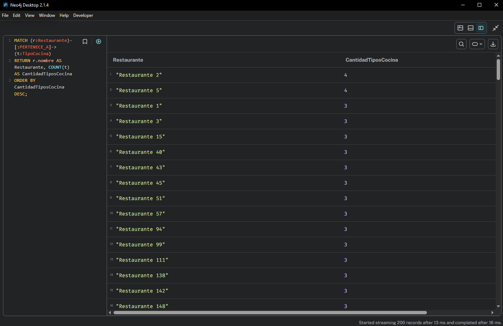

<br>

### Consulta 2: Tasa de reservas por restaurante
**Detalle:** Calcula qué porcentaje de los clientes que visitaron un restaurante hicieron reserva previa, mostrando el total de visitas y las que tenían reserva.
```cypher
MATCH (r:Restaurante)<-[v:VISITO]-(:Usuario)
RETURN r.nombre AS Restaurante,
       COUNT(v) AS TotalVisitas,
       ROUND(100.0 * SUM(CASE WHEN v.conReserva THEN 1 ELSE 0 END) / COUNT(v), 2) AS PorcentajeReservas
ORDER BY PorcentajeReservas DESC;
```
**Resultado Esperado:**
> 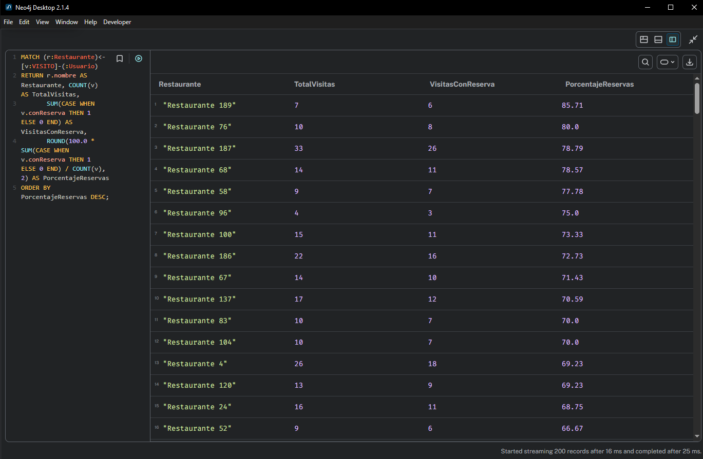

<br>

### Consulta 3: Gasto promedio por visita
**Detalle:** Averigua cuál es el ticket promedio o gasto medio por usuario al visitar los distintos restaurantes.
```cypher
MATCH (:Usuario)-[v:VISITO]->(r:Restaurante)
RETURN r.nombre AS Restaurante, ROUND(AVG(v.consumo), 2) AS GastoPromedio
ORDER BY GastoPromedio DESC;
```
**Resultado Esperado:**
> 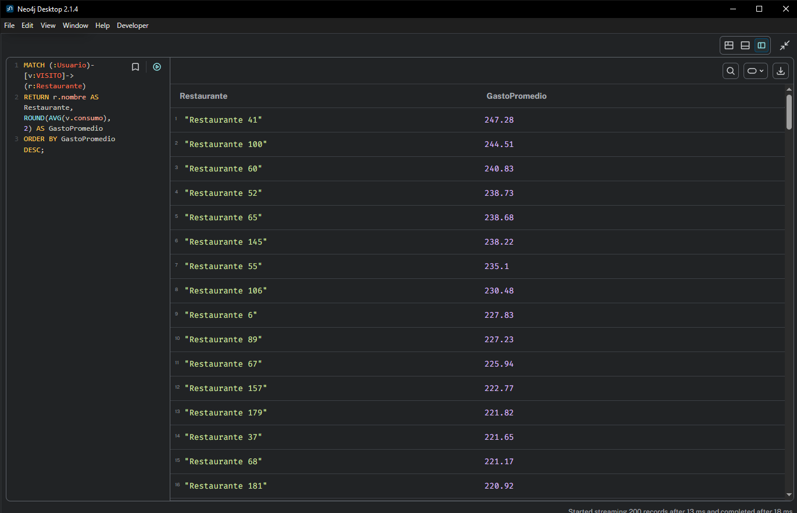

<br>

### Consulta 4: Frecuencia de visitas por mes
**Detalle:** Agrupación cronológica. Cuenta el total de visitas recibidas en todos los restaurantes agrupadas por mes y año.
```cypher
MATCH (:Usuario)-[v:VISITO]->(:Restaurante)
RETURN v.fechaVisita.year AS Anio, v.fechaVisita.month AS Mes, COUNT(*) AS TotalVisitas
ORDER BY Anio, Mes;
```
**Resultado Esperado:**
> 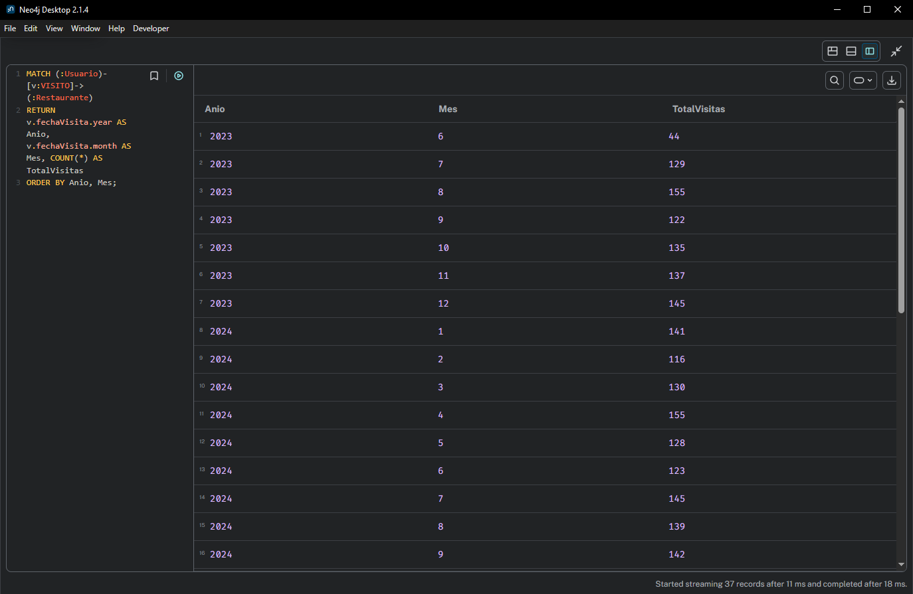

<br>

### Consulta 5: Restaurante sin visitas recientes (últimos 30 días)
**Detalle:** Busca restaurantes que no han sido visitados en absoluto, o aquellos cuya fecha de última visita es mayor a 30 días desde la fecha actual.
```cypher
MATCH (r:Restaurante)
OPTIONAL MATCH (:Usuario)-[v:VISITO]->(r)
WITH r, MAX(v.fechaVisita) AS UltimaVisita
WHERE UltimaVisita IS NULL OR UltimaVisita < date() - duration('P30D')
RETURN r.nombre AS Restaurante, UltimaVisita
ORDER BY UltimaVisita;
```
**Resultado Esperado:**
> 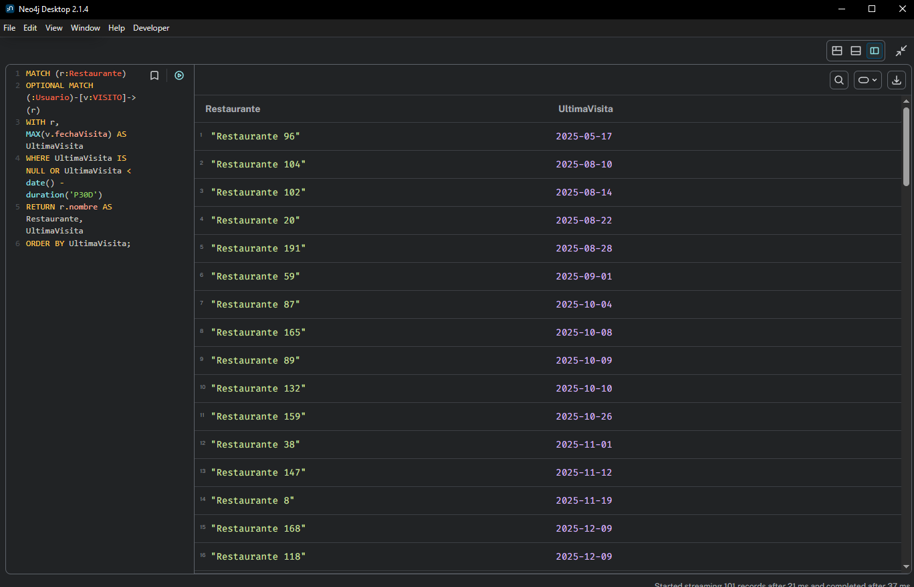

<br>

### Consulta 6: Movilidad de Chefs
**Detalle:** Determina en la trayectoria en qué cantidad de restaurantes distintos ha trabajado o está trabajando cada Chef.
```cypher
MATCH (c:Chef)-[:TRABAJA_EN]->(r:Restaurante)
RETURN c.idChef AS ID, c.nombre AS Chef, COUNT(DISTINCT r) AS RestaurantesTrabajados
ORDER BY RestaurantesTrabajados DESC;
```
**Resultado Esperado:**
> 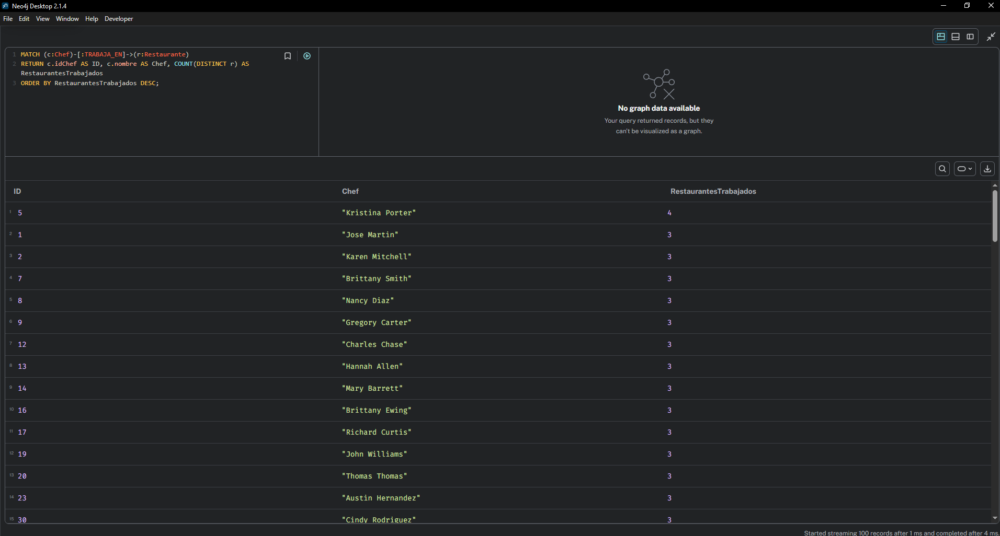

<br>

### Consulta 7: Variación de Precios de Platillos
**Detalle:** Determina la volatilidad económica dentro del mismo menú de un restaurante, calculando la diferencia entre el platillo más caro y el más barato que ofrece.
```cypher
MATCH (r:Restaurante)-[o:OFRECE]->(p:Platillo)
RETURN p.nombre AS Platillo, MIN(o.precio) AS PrecioMinimo, MAX(o.precio) AS PrecioMaximo, ROUND(MAX(o.precio) - MIN(o.precio), 2) AS Diferencia
ORDER BY Diferencia DESC;
```
**Resultado Esperado:**
> 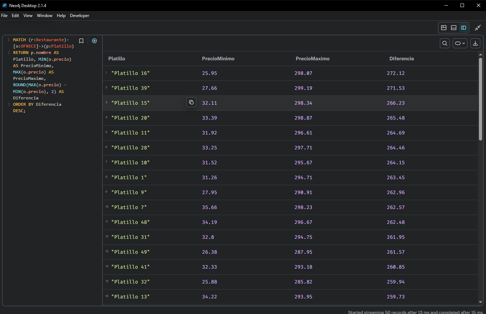

<br>

### Consulta 8: Visitas por tipo de cocina
**Detalle:** Enumera los tipos de cocina ordenados por aquellos que reciben la mayor cantidad de visitas en el grueso de restaurantes.
```cypher
MATCH (:Usuario)-[:VISITO]->(r:Restaurante)
MATCH (r)-[:PERTENECE_A]->(t:TipoCocina)
RETURN t.nombreTipo AS TipoCocina, COUNT(*) AS TotalVisitas
ORDER BY TotalVisitas DESC;
```
**Resultado Esperado:**
> 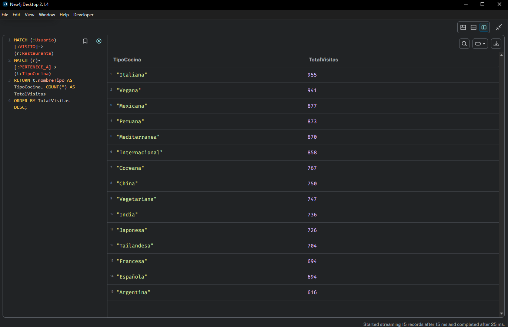

<br>

### Consulta 9: Restaurantes populares entre amigos (Graph Social)
**Detalle:** A través del vínculo directo `ES_AMIGO_DE` retorna a un usuario específico la trayectoria que cruza hacia restaurantes visitados por sus amistades (recomendación social).
```cypher
MATCH (u:Usuario {idUsuario: 1})-[:ES_AMIGO_DE]-(amigo:Usuario)
MATCH (amigo)-[v:VISITO]->(r:Restaurante)
WHERE NOT EXISTS { MATCH (u)-[:VISITO]->(r) }
RETURN u, amigo, v, r
LIMIT 20;
```
**Resultado Esperado:**
> 

<br>

### Consulta 10A: Recomendación basada en chefs compartidos
**Detalle:** Cruza chefs compartidos sugiriendo restaurantes basándose únicamente en el histórico de visitas del usuario; rastreando restaurantes donde el chef actual también labora.
```cypher
MATCH (u:Usuario {idUsuario: 1})-[:VISITO]->(r1:Restaurante)
MATCH (r1)<-[:TRABAJA_EN]-(c:Chef)-[:TRABAJA_EN]->(r2:Restaurante)
WHERE r1 <> r2 AND NOT EXISTS { MATCH (u)-[:VISITO]->(r2) }
RETURN r2.idRestaurante AS ID, r2.nombre AS RestauranteRecomendado, COUNT(DISTINCT c) AS ChefsCompartidos
ORDER BY ChefsCompartidos DESC, RestauranteRecomendado
LIMIT 10;
```
**Resultado Esperado:**
> 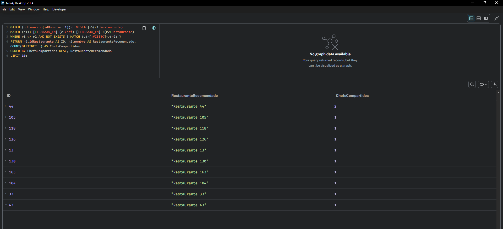

<br>

### Consulta 10B: Recomendación basada en restaurantes bien valorados
**Detalle:** Perfecciona la lógica 10A mediante un filtro de satisfacción. Se asegura que la ruta de origen no provenga solo de lugares visitados, sino explícitamente evaluados con `cal.puntuacion >= 4`.
```cypher
MATCH (u:Usuario {idUsuario: 1})-[cal:CALIFICO]->(r1:Restaurante)
WHERE cal.puntuacion >= 4
MATCH (r1)<-[:TRABAJA_EN]-(c:Chef)-[:TRABAJA_EN]->(r2:Restaurante)
WHERE r1 <> r2 AND NOT EXISTS { MATCH (u)-[:VISITO]->(r2) }
RETURN r2.idRestaurante AS ID, r2.nombre AS RestauranteRecomendado, COUNT(DISTINCT c) AS ChefsCompartidos
ORDER BY ChefsCompartidos DESC, RestauranteRecomendado
LIMIT 10;
```
**Resultado Esperado:**
> 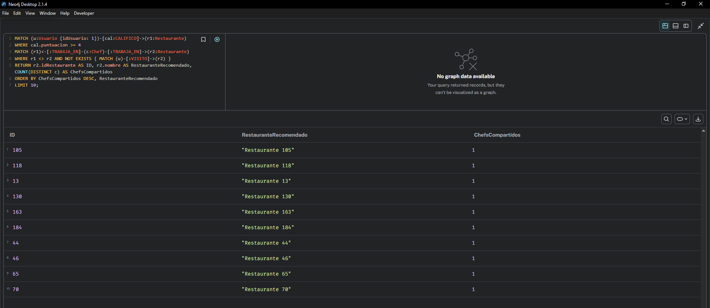

<br>

### Consulta 10C: Recomendación Avanzada Multiniveles
**Detalle:** Esta es la consulta más exhaustiva del sistema de recomendación. Cruza el historial del usuario, asegura un factor numérico de sabor (`calificacion>=4`) y mediante un recorrido en los nodos `Chef` halla subnúcleos (restaurantes) no visitados por el usuario integrando la centralidad del cocinero.
```cypher
MATCH (u:Usuario {idUsuario: 1})
MATCH (u)-[cal:CALIFICO]->(r1:Restaurante)
WHERE cal.puntuacion >= 4
MATCH (r1)<-[:TRABAJA_EN]-(c:Chef)-[:TRABAJA_EN]->(r2:Restaurante)
WHERE r1 <> r2 AND NOT EXISTS { MATCH (u)-[:VISITO]->(r2) }
RETURN r2.idRestaurante AS ID, r2.nombre AS RestauranteRecomendado,
COUNT(DISTINCT c) AS ChefsCompartidos, AVG(cal.puntuacion) AS PromedioCalificacionOrigen
ORDER BY ChefsCompartidos DESC, PromedioCalificacionOrigen DESC
LIMIT 10;
```
**Resultado Esperado:**
> 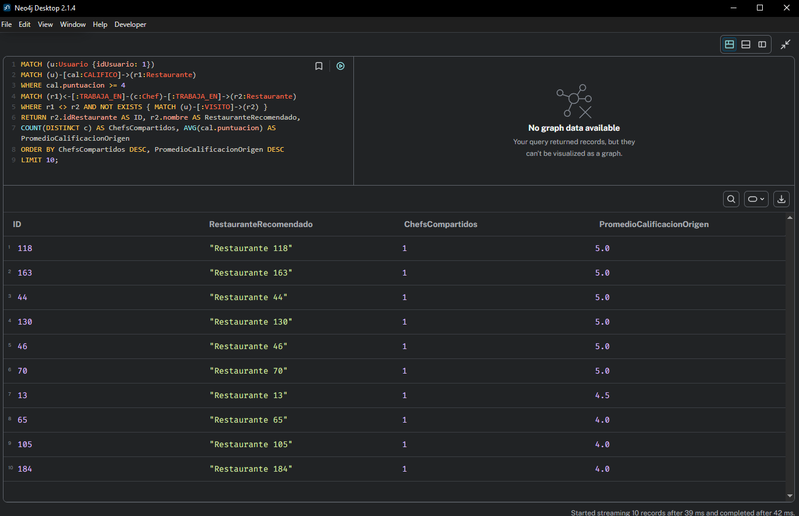

<br>

---

## 4. Análisis de Redes (Grafos Avanzados)

### 4.1 Grados de Separación (Shortest Path)
**Detalle:** Usando algoritmos nativos (`shortestPath`), determinamos la ruta física visual más corta entre el Usuario *1* y el Usuario *10* apoyándonos estrictamente en vínculos de amistad directos (`ES_AMIGO_DE`).
```cypher
MATCH p = shortestPath((u1:Usuario {idUsuario: 1})-[:ES_AMIGO_DE*..5]-(u2:Usuario {idUsuario: 10}))
RETURN p;
```
**Resultado Esperado:**
> 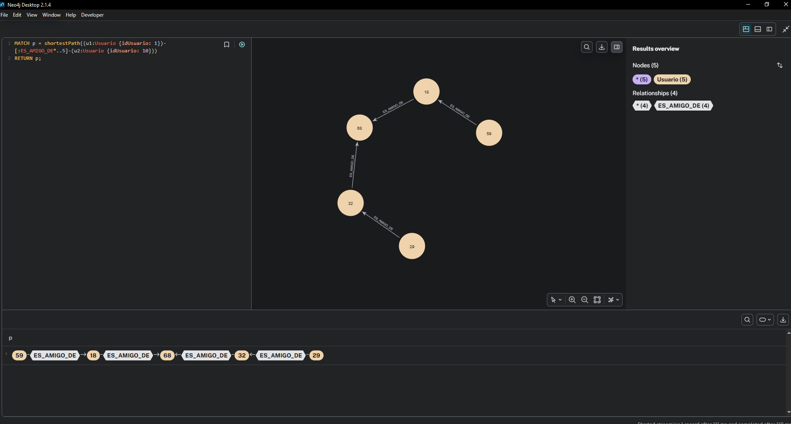

<br>

### 4.2 Centralidad y Conectividad (Restaurantes Altamente Conectados)
**Detalle:** Identifica visualmente los restaurantes "hub" determinando cuáles tienen la mayor suma de relaciones de entrada (recibieron más conexiones) y atrayendo todos los nodos vecinos para renderizar su nube de influencia.
```cypher
MATCH (r:Restaurante)<-[rel]-(nodoExterno)
WITH r, COUNT(rel) as Conexiones
ORDER BY Conexiones DESC LIMIT 5
MATCH (r)<-[rel]-(nodoExterno)
RETURN r, rel, nodoExterno LIMIT 150;
```
**Resultado Esperado:**
> 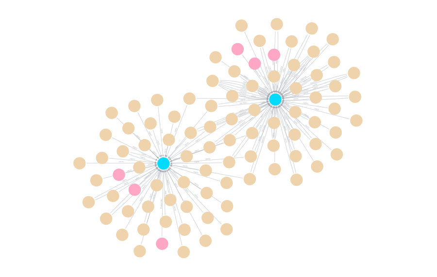

<br>

---

## 5. Ventajas de Neo4j para este problema

*   **Libertad de los Joins (Index-Free Adjacency):** Si modeláramos esto en un sistema Relacional (SQL), recomendar restaurantes usando 4 variables *(Usuarios > Calificaciones > Restaurantes > Chefs > Restaurantes Futuros)* requeriría al menos 5 o 6 comandos `JOIN`. Esto genera problemas exponenciales (cargas de RAM excesivas). En Neo4j, al atravesar nodos *(Traversal)* la consulta es instantánea, sin importar cuántos millones de clientes generó el CSV.
*   **Modelado Visual Natural:** Es idéntico a una pizarra blanca. Usuario `VISITA` Restaurante. 
*   **Capacidades Sociales Orgánicas:** El sistema permite explotar relaciones indirectas muy fáciles (ej. `Match (usuario)-[:Amigo]-(amigo)-[:Visita]->(Restaurante)`). Hacer ese descubrimiento transitivo en SQL requiere iteradores engorrosos. 

---

## 6. Conclusiones
*   La implementación del sistema demostró que Neo4j facilita el desarrollo iterativo y natural de reglas de negocio sobre conectividad humana y empresarial.
*   La integración híbrida `Python-Script <> Cypher-Load` ha probado ser el estándar más alto para asimilar altos volúmenes de datos simulados a nivel educativo, sosteniendo tiempos de inyección de aristas muy agresivos sin sacrificar la topología de la red de restaurantes.
*   Las consultas de recomendación logran cruzar lógicas de más de tres variables ("Sabor", "Relación Laboral Externa" e "Inédito para el usuario") de manera simple, comprobando que las bases NoSQL de grafos son idóneas y obligatorias para Sistemas de Recomendación.