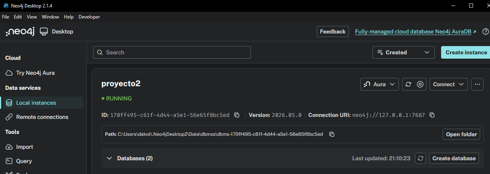
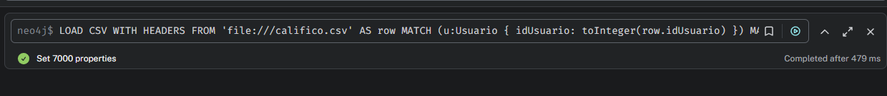
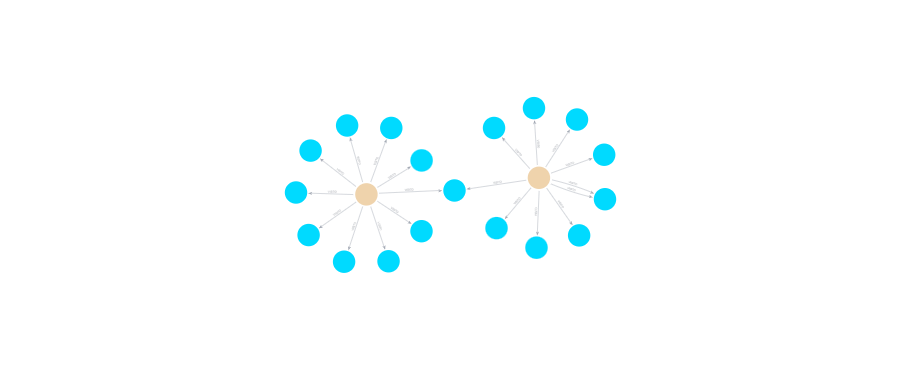
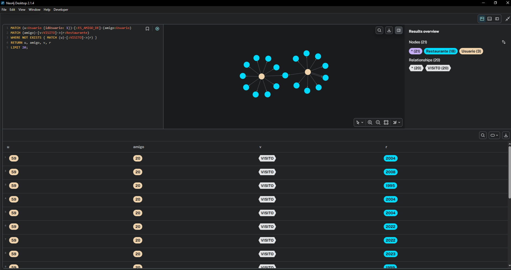
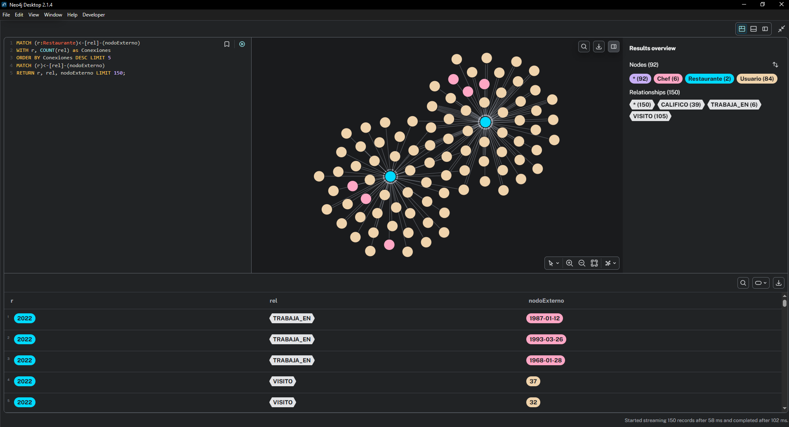
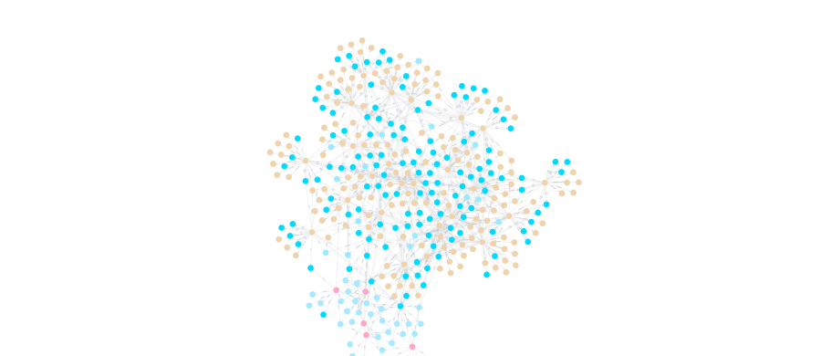
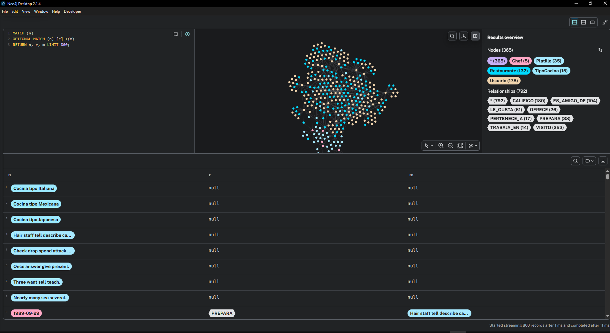

# Manual de Usuario - Sistema de Recomendación Neo4j

Bienvenido al sistema de recomendación de restaurantes. Este manual está diseñado para guiar a un operador o administrador paso a paso desde el montaje de la base de datos hasta la ejecución y comprensión de las consultas analíticas.

---

## 1. Requisitos e Instalación de Neo4j

### 1.1 Descargar Neo4j Desktop
1. Diríjase a la página oficial: `https://neo4j.com/download/`
2. Descargue **Neo4j Desktop** (requerirá un correo para generar una clave de activación gratuita).
3. Instale el programa ejecutando el archivo `.exe` descargado e ingrese la clave o sáltela usando activación local.

### 1.2 Crear su Primer DBMS y Base de Datos
1. Al abrir Neo4j Desktop, diríjase a la sección **"Local instances"** en el panel izquierdo.
2. Haga clic en el botón superior derecho **"Create instance"** y elija **"Local DBMS"**.
3. Nombre su base de datos como `proyecto2` u otro de su preferencia, y asígnele una contraseña (anótela bien, ya que será la contraseña de administrador `neo4j`).
4. Haga clic en el botón verde **"Start"** o la flecha de encendido para iniciar el servidor de la base de datos (pasará a estado *RUNNING*).


  > *Instancia "proyecto2" en estado RUNNING*

  > 

### 1.3 Acceso a la Consola (Neo4j Browser) y Verificación

Usted tiene dos opciones válidas para acceder a la consola donde ejecutará sus comandos (puede elegir la que prefiera, ambas apuntan a la misma base de datos):

**Opción A: Desde la aplicación de escritorio (Recomendada)**
- En Neo4j Desktop, al lado de su base de datos iniciada, simplemente haga clic en el botón azul **"Open"** o en la sección lateral de herramientas abra **"Neo4j Browser"**. Esto abrirá la consola incrustada automáticamente sin tener que loguearse.

**Opción B: Desde su navegador web (Chrome, Edge, etc.)**
- Con Neo4j Desktop iniciado en el fondo, abra su navegador web y diríjase a: `http://localhost:7474`
- En la pantalla de login ingrese sus credenciales:
  - Usuario: `neo4j`
  - Password: la contraseña que configuró en el paso anterior.

**Verificar conexión:**
Una vez dentro de la interfaz gráfica, para asegurarse de que todo está funcionando, ejecute el siguiente comando de prueba en la consola superior:

```cypher
RETURN "Neo4j conectado correctamente";
```
Si la consola le devuelve una tabla con ese texto, ¡felicidades! El sistema está listo.

---

## 2. Metodología de Generación y Carga de Datos

El sistema de modelado exige cantidades masivas de datos para que las recomendaciones por rutas de interacción (`shortestPath`) cobren sentido. El proceso consta de la construcción procedural en un lenguaje de alto nivel (Python), traslado y finalmente ingesta masiva en Neo4j.

### 2.1 Fase A: Creación de Set de Datos (generatorCSV.py)
Para asegurar de que la información respete el volumen requerido (500 usuarios, 200 restaurantes, 100 chefs, 50 platillos y 15 tipos de cocina) de forma lógica y libre de faltas sintácticas, el proyecto utiliza la biblioteca `Faker` y `random` en Python para la creación aleatorizada y su guardado en formato CSV puro.

**¿Cómo funciona internamente?**
El script define iteraciones fijas para exportar los Nodos con sus campos, y posteriormente generar relaciones cruzadas asignando aleatoriamente los Id's creados. *Por ejemplo, para usuarios:*
```python
# Ejemplo extraido de generatorCSV.py
for i in range(1, TOTAL_USUARIOS + 1):
    writer.writerow([
        i,                    # idUsuario
        fake.name(),          # nombre
        fake.email(),         # email
        random.randint(18, 65),# edad
        fake.country()        # pais
    ])
```

**Ejecución:**
1. Abra la terminal en la carpeta principal del proyecto.
2. Navegue al módulo de python: `cd python`.
3. Ejecute la construcción: `python generatorCSV.py`.
   *Los archivos resultantes se habrán depositado en la carpeta `/CSV` exterior.*

### 2.2 Fase B: Acoplamiento de Entorno (sendCSVs.py)
Las instancias gráficas locales de Neo4j están aisladas por motivos de seguridad; no pueden leer directorios arbitrarios de su computadora. Por lo tanto, los archivos recién generados deben ser llevados a la carpeta oculta inteligente `import/` del Neo4j DBMS.

1. Debe localizar esa ruta secreta en Neo4j Desktop (Deje clic en los `...` en la instancia > presione `Open folder` > `Import`).
2. Copie la ruta exploradora de Windows en su archivo `.env` del repositorio:
   ```env
   NEO4J_IMPORT_DIR=C:\Users\SuUsuario\.Neo4jDesktop\...\import
   ```
3. Ejecute el despachador inteligente en Python:
   `python sendCSVs.py`
   *(Esto correrá un script interno que usa `os` y `shutil.copy2` para traspasar de forma íntegra los trece CSVs desde nuestra carpeta hacia la carpeta de ingestión del servidor).*

### 2.3 Fase C: Ingesta al Grafo (`LOAD CSV`)
Habiendo dejado los insumos en Neo4j, se utiliza `LOAD CSV` y `MERGE` en lugar de miles de sentencias estáticas `CREATE`, puesto que es exponencialmente más veloz para bases de datos pobladas.

1. Abra Neo4j Browser apuntando a la base de datos `restaurantes`.
2. Habilite las estructuras (Corra `1_Constraints.cypher` bloque por bloque).
3. Habilite la aceleración de lectura (Corra `2_indices.cypher` bloque por bloque).
4. Abra su archivo `4_loadCSV.cypher` y pegue la ejecución de lectura bloque por bloque.

**Ejemplo demostrativo de cómo ingresa la data de Relaciones:**
```cypher
LOAD CSV WITH HEADERS FROM 'file:///califico.csv' AS row
MATCH (u:Usuario { idUsuario: toInteger(row.idUsuario) })
MATCH (r:Restaurante { idRestaurante: toInteger(row.idRestaurante) })
MERGE (u)-[rel:CALIFICO { fecha: date(row.fecha) }]->(r)
SET rel.puntuacion = toInteger(row.puntuacion), rel.comentario = row.comentario;
```
*Se hace match a los ID originados en el CSV y se conecta la arista con atributos nativos incrustados.*

  > *Terminal mostrando Python y Browser con el LOAD de muestra*

  > 
---

## 3. Guía de Ejecución de Consultas con Ejemplos Prácticos

A continuación aprenderá a extraer el valor real del sistema en Neo4j Browser ejecutando el código del archivo `5_consultas.cypher`. 

**Pasos Clave Previos:**
* Ejecute una consulta a la vez pegando el código en la barra superior y presionando `Enter` o el botón "Play".

### Consulta 1: Diversidad de Tipos de Cocina
**Objetivo:** Conocer la variedad gastronómica de los restaurantes evaluando cuántos tipos de cocina abarca cada uno.
```cypher
MATCH (r:Restaurante)-[:PERTENECE_A]->(t:TipoCocina)
RETURN r.nombre AS Restaurante, COUNT(t) AS CantidadTiposCocina
ORDER BY CantidadTiposCocina DESC;
```
**Interpretación:** La tabla resultante indicará los restaurantes en orden descendente. Un local con "4" o "5" indicaría que sirve menús muy variados (fusión), mientras que los "1" son restaurantes muy tradicionales y puntuales.

  > *Resultado tabular Consulta 1*

  > 

### Consulta 2: Tasa de Reservas por Restaurante
**Objetivo:** Identificar el comportamiento de planificación del cliente, analizando el volumen de visitas con reserva vs visitas instantáneas.
```cypher
MATCH (r:Restaurante)<-[v:VISITO]-(:Usuario)
RETURN r.nombre AS Restaurante, COUNT(v) AS TotalVisitas,
       SUM(CASE WHEN v.conReserva THEN 1 ELSE 0 END) AS VisitasConReserva,
       ROUND(100.0 * SUM(CASE WHEN v.conReserva THEN 1 ELSE 0 END) / COUNT(v), 2) AS PorcentajeReservas
ORDER BY PorcentajeReservas DESC;
```
**Interpretación:** Muestra el número Total de llegadas y la última columna es el porcentaje `(ej. 75.5%)`. Valores bajos pueden significar que el local vive de clientes transeúntes, lo que afecta la planificación de compras del Chef.


  > *Resultado tabular Consulta 2*

  > 

### Consulta 3: Gasto Promedio por Visita
**Objetivo:** Identificar el nivel de gasto (ticket promedio) asociado a cada locación.
```cypher
MATCH (:Usuario)-[v:VISITO]->(r:Restaurante)
RETURN r.nombre AS Restaurante, ROUND(AVG(v.consumo), 2) AS GastoPromedio
ORDER BY GastoPromedio DESC;
```
**Interpretación:** Ayuda a segmentar los restaurantes más elitistas en contraposición con los más económicos basados estrictamente en el consumo histórico.


> *Resultado tabular Consulta 3*

  > 

### Consulta 4: Frecuencia de Visitas por Mes
**Objetivo:** Medir el tráfico de la red gastronómica de la plataforma a través de los diversos meses del año.
```cypher
MATCH (:Usuario)-[v:VISITO]->(:Restaurante)
RETURN v.fechaVisita.year AS Anio, v.fechaVisita.month AS Mes, COUNT(*) AS TotalVisitas
ORDER BY Anio, Mes;
```
**Interpretación:** Permite predecir temporadas altas de consumo en el año a través de la sumatoria general de las transacciones (visitas).

> *Resultado tabular Consulta 4*

  > 

### Consulta 5: Restaurantes sin Visitas Recientes
**Objetivo:** Detectar "Restaurantes Muertos" o negocios que necesitan campañas urgentes.
```cypher
MATCH (r:Restaurante)
OPTIONAL MATCH (:Usuario)-[v:VISITO]->(r)
WITH r, MAX(v.fechaVisita) AS UltimaVisita
WHERE UltimaVisita IS NULL OR UltimaVisita < date() - duration('P30D')
RETURN r.nombre AS Restaurante, UltimaVisita
ORDER BY UltimaVisita;
```
**Interpretación:** Arroja el listado de locales cuya fecha es lejana en el tiempo (30 días de diferencia) o que sencillamente nunca lograron jalar el interés de la gente y aparece nula (`NULL`).

> *Resultado tabular Consulta 5*

  > 

### Consulta 6: Movilidad Laboral de Chefs
**Objetivo:** Examinar qué Chefs han trabajado la mayor cantidad de establecimientos durante su carrera.
```cypher
MATCH (c:Chef)-[:TRABAJA_EN]->(r:Restaurante)
RETURN c.idChef AS ID, c.nombre AS Chef, COUNT(DISTINCT r) AS RestaurantesTrabajados
ORDER BY RestaurantesTrabajados DESC;
```
**Interpretación:** Aquellos Chefs con puntajes más altos son altamente experimentados o "Consultores" gastronómicos dentro del clúster de base de datos.

> *Resultado tabular Consulta 6*

  > 

### Consulta 7: Variación de Precios de Platillos
**Objetivo:** Determinar la volatilidad económica dentro del mismo menú de un restaurante.
```cypher
MATCH (r:Restaurante)-[o:OFRECE]->(p:Platillo)
RETURN p.nombre AS Platillo, MIN(o.precio) AS PrecioMinimo, MAX(o.precio) AS PrecioMaximo, ROUND(MAX(o.precio) - MIN(o.precio), 2) AS Diferencia
ORDER BY Diferencia DESC;
```
**Interpretación:** Mientras mayor sea la "Diferencia", indica que el local tiene tanto platillos muy "Premium" como opciones de entrada o "Basales" para captar diferentes tipos de público.

> *Resultado tabular Consulta 7*

  > 

### Consulta 8: Tendencias por Tipo de Cocina
**Objetivo:** Encontrar el sabor preferido en la comunidad.
```cypher
MATCH (:Usuario)-[:VISITO]->(r:Restaurante)
MATCH (r)-[:PERTENECE_A]->(t:TipoCocina)
RETURN t.nombreTipo AS TipoCocina, COUNT(*) AS TotalVisitas
ORDER BY TotalVisitas DESC;
```
**Interpretación:** Brinda un listado clave que indica si la base de datos se inclina hacia la comida Italiana o Nacional según el histórico total.

> *Resultado tabular Consulta 8*

  > 

### Consulta 9: Recomendación Social (Amigos en el Grafo - VISUALIZABLE)
**Objetivo:** Recomendar a un usuario un lugar basado a donde fueron los usuarios que son sus "Amigos", omitiendo lugares a donde este ya haya ido. (Análisis de rutas sociales). Esta versión está optimizada para generar nodos de grafo.
```cypher
MATCH (u:Usuario {idUsuario: 1})-[:ES_AMIGO_DE]-(amigo:Usuario)
MATCH (amigo)-[v:VISITO]->(r:Restaurante)
WHERE NOT EXISTS { MATCH (u)-[:VISITO]->(r) }
RETURN u, amigo, v, r
LIMIT 20;
```
**Interpretación:** Muestra visualmente la red del usuario y sus amigos apuntando hacia los restaurantes que han visitado. Esto le permite al usuario explorar visualmente las recomendaciones sugeridas por su círculo cercano.

> *Visualización en Grafo de Consulta 9*

  > 

  > 

### Consulta 10A: Recomendación basada en chefs compartidos (Historial)
**Objetivo:** Sugerir restaurantes utilizando la lógica de que un Chef de un lugar que ya visitaste trabaje ahora en un lugar nuevo.
```cypher
MATCH (u:Usuario {idUsuario: 1})-[:VISITO]->(r1:Restaurante)
MATCH (r1)<-[:TRABAJA_EN]-(c:Chef)-[:TRABAJA_EN]->(r2:Restaurante)
WHERE r1 <> r2 AND NOT EXISTS { MATCH (u)-[:VISITO]->(r2) }
RETURN r2.idRestaurante AS ID, r2.nombre AS RestauranteRecomendado, COUNT(DISTINCT c) AS ChefsCompartidos
ORDER BY ChefsCompartidos DESC, RestauranteRecomendado
LIMIT 10;
```
**Interpretación:** Genera una tabla de recomendaciones basada únicamente en la movilidad de los cocineros.

> *Resultado tabular Consulta 10A*

  > 

### Consulta 10B: Recomendación basada en restaurantes bien valorados
**Objetivo:** Refinar las sugerencias de chefs, limitando la búsqueda a aquellos lugares a los que se les dio de puntuación 4 estrellas o más.
```cypher
MATCH (u:Usuario {idUsuario: 1})-[cal:CALIFICO]->(r1:Restaurante)
WHERE cal.puntuacion >= 4
MATCH (r1)<-[:TRABAJA_EN]-(c:Chef)-[:TRABAJA_EN]->(r2:Restaurante)
WHERE r1 <> r2 AND NOT EXISTS { MATCH (u)-[:VISITO]->(r2) }
RETURN r2.idRestaurante AS ID, r2.nombre AS RestauranteRecomendado, COUNT(DISTINCT c) AS ChefsCompartidos
ORDER BY ChefsCompartidos DESC, RestauranteRecomendado
LIMIT 10;
```
**Interpretación:** Añade un filtro de calidad "sabor" al motor de búsqueda cruzándolo con la primera condición.

> *Resultado tabular Consulta 10B*

  > 

### Consulta 10C: Recomendación Avanzada Inteligente (Motor de Neo4j)
**Objetivo:** Recomendación máxima cruzando historial de buen sabor, con la retención de los cocineros subyacentes.
```cypher
MATCH (u:Usuario {idUsuario: 1})
MATCH (u)-[cal:CALIFICO]->(r1:Restaurante)
WHERE cal.puntuacion >= 4
MATCH (r1)<-[:TRABAJA_EN]-(c:Chef)-[:TRABAJA_EN]->(r2:Restaurante)
WHERE r1 <> r2 AND NOT EXISTS { MATCH (u)-[:VISITO]->(r2) }
RETURN r2.idRestaurante AS ID, r2.nombre AS RestauranteRecomendado,
COUNT(DISTINCT c) AS ChefsCompartidos, AVG(cal.puntuacion) AS PromedioCalificacionOrigen
ORDER BY ChefsCompartidos DESC, PromedioCalificacionOrigen DESC
LIMIT 10;
```
**Interpretación:** De todo el universo de restaurantes, solo extrae aquellos donde el sabor garantizado (Calificado como superior o igual a 4) proviene de un empleado (Chef) que actualmente labora en otros establecimientos que el cliente no ha detectado aún.


> *Resultado de Consulta Avanzada Múltiple*

  > 
  
### Análisis de Redes 1: Grados de Separación (Shortest Path)
**Objetivo:** Usualmente, evaluar grafos consiste en ver algoritmos físicos. Aquí demostramos cómo el sistema halla la arista/ruta más corta entre dos usuarios para fines de recomendaciones extendidas.
```cypher
MATCH p = shortestPath((u1:Usuario {idUsuario: 1})-[:ES_AMIGO_DE*..5]-(u2:Usuario {idUsuario: 10}))
RETURN p;
```
**Interpretación:** Muestra el camino físico. Usted verá en el modo Graph al Usuario 1, conectado mediante líneas de amistad a otros saltos intermedios hasta alcanzar al Usuario 10. Si le muestra una tabla vacía, significa que en toda su base de datos aleatoria o de importación, el usuario 1 y 10 no comparten cadena de amigos.


> *Fotografía de Grafo de la ruta más corta (shortestPath)*

  > 

### Análisis de Redes 2: Restaurantes Altamente Conectados (Visual)
**Objetivo:** Mostrar cuáles son los Restaurantes más "populares" y ver físicamente su nube de influencia (La gente y los cocineros fluyendo hacia ellos).
```cypher
MATCH (r:Restaurante)<-[rel]-(nodoExterno)
WITH r, COUNT(rel) as Conexiones
ORDER BY Conexiones DESC LIMIT 5
MATCH (r)<-[rel]-(nodoExterno)
RETURN r, rel, nodoExterno LIMIT 150;
```
**Interpretación:** En el modo Graph verá núcleos (Restaurantes). Los núcleos más grandes estarán rodeados de decenas de flechas entrando (Nodos de Visita de usuarios o de Trabaja de Chefs). ¡Esta es la evidencia perfecta del Análisis de Redes y Centralidad!


> *Resultado tabular Consulta Restaurantes*

  > 

  > 

### Obtener Visión de Grafo Analítica General (El entorno interactivo de Neo4j)
Para asimilar el inmenso poder de cruce de Neo4j y la ruta de **Redes Interconectadas**, se ejecuta una búsqueda parcial abierta:
```cypher
MATCH (n)
OPTIONAL MATCH (n)-[r]->(m)
RETURN n, r, m LIMIT 800;
```
Al hacerlo, cambie de la pestaña "Table" a la "Graph". Puede hacer clic sobre las etiquetas flotantes (`Usuario`, `Restaurante`, `Chef`) a la derecha de la pantalla y asignar un color para cada nodo y tamaño de burbuja para formar sus gráficas impactantes y analizar el Hub general.


> *Resultado de grafo de la base de datos, con sus colores o nodos expandidos*

  > 

  > 

---

## 4. Resolución de Problemas (Troubleshooting)

**Problema 1: Neo4j dice "Couldn't load the external resource..." al usar LOAD CSV.**
*Causa:* Neo4j busca los CSV por seguridad solo en su propia carpeta `import`.
*Solución:* Asegúrese que los CSV han sido copiados manualmente desde su computadora hacia la carpeta `import` de la base de Neo4j o revise el archivo de variables de Python en el paso 2.1.

**Problema 2: Neo4j arroja error de "Must create constraint first" o "Duplicate IDs".**
*Causa:* Probablemente corrió el archivo de relaciones o de CSV múltiples veces generando fantasmas.
*Solución:* Limpie todo escribiendo `MATCH (n) DETACH DELETE n;`, luego reinicie desde el archivo `1_Constraints.cypher` asegurándose de habilitarlos antes de la carga de datos.

**Problema 3: "Multiple statement queries are separated by...".**
*Causa:* Trató de pegar varios `MATCH` o `LOAD CSV` juntos en una misma senteda en el cuadro de búsqueda.
*Solución:* Neo4j se traba si le pide ejecutar 5 programas lógicos unidos si no está activado su panel avanzado; pegue un bloque, dé "Play", lo borra de la barra, y luego el siguiente bloque.